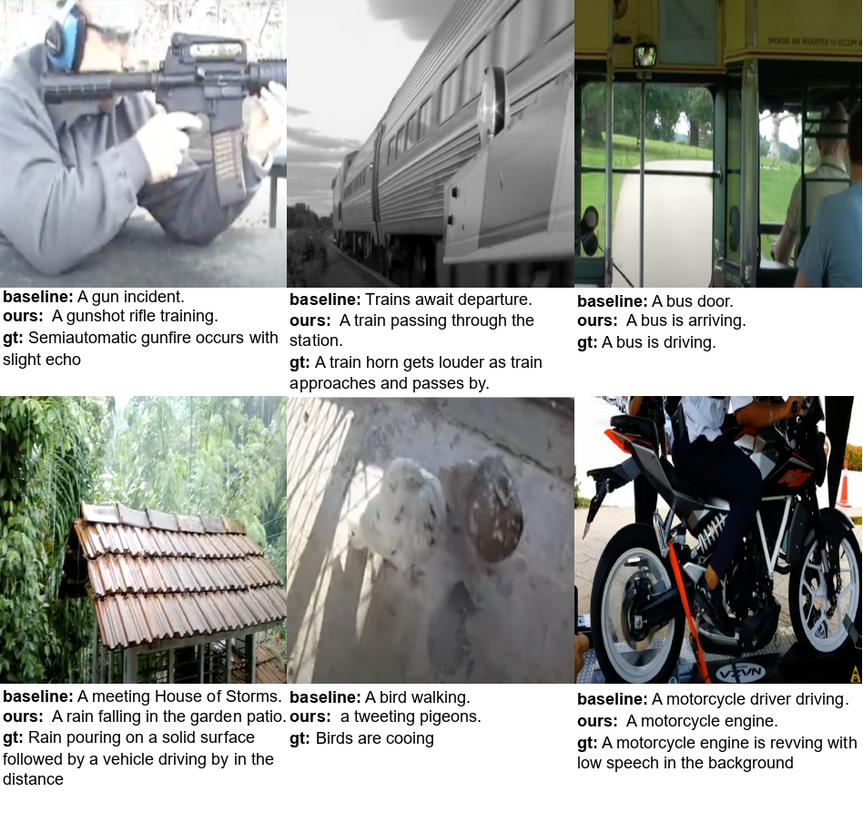

# ZERO-SHOT AUDIO CAPTIONING VIA AUDIBILITY GUIDANCE

<p align="center">

<a href="https://arielshaulov.github.io/zero-shot-audio-captioning/"></a> 
 <a href="https://arxiv.org/abs/2309.03884"></a>

> The task of audio captioning is similar in essence to tasks such as image and video captioning. However, it has received much less attention. We propose three desiderata for captioning audio -- (i) fluency of the generated text, (ii) faithfulness of the generated text to the input audio, and the somewhat related (iii) audibility, which is the quality of being able to be perceived based only on audio. Our method is a zero-shot method, i.e., we do not learn to perform captioning. Instead, captioning occurs as an inference process that involves three networks that correspond to the three desired qualities: (i) A Large Language Model, in our case, for reasons of convenience, GPT-2, (ii) A model that provides a matching score between an audio file and a text, for which we use a multimodal matching network called ImageBind, and (iii) A text classifier, trained using a dataset we collected automatically by instructing GPT-4 with prompts designed to direct the generation of both audible and inaudible sentences. We present our results on the AudioCap dataset, demonstrating that audibility guidance significantly enhances performance compared to the baseline, which lacks this objective.

## Description  
Official implementation of the paper Zero Shot Audio Cpationing via Audibility Guidance.
 <br>

## Concept Explanation with Conceptor
<p align="center">
  
<br>
Examples of generated captions without (baseline) and with (ours) the audibility guidance, compared to the GT.
</p>

## Citing our paper
If you make use of our work, please cite our paper:
```
@article{shaharabany2023zero,
  title={Zero-Shot Audio Captioning via Audibility Guidance},
  author={Shaharabany, Tal and Shaulov, Ariel and Wolf, Lior},
  journal={arXiv preprint arXiv:2309.03884},
  year={2023}
}
```
